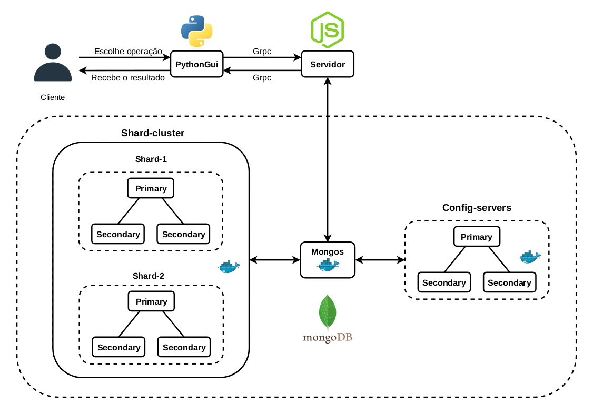

# Sharding-SD-2022-1

### MongoDB com Sharding

O MongoDB fornece a funcionalidade de sharding, que é um método para distribuir dados entre várias máquinas. Ele utiliza o sharding para dar suporte a implantações com conjuntos grandes de dados e operações de alto rendimento.

### Preparando o ambiente

#### Ferramentas necessárias:

* [Docker](https://www.docker.com/)
* [MongoDB](https://www.mongodb.com/)

#### Servidores de configuração

Inicialmente acesse o diretório "config-server", e execute o seguinte comando:

```bash
sudo docker-compose up -d
```

Em seguida, acesse o mongo na porta 40001 com o seu endereço ipv4, com o seguinte comando:

```bash
mongo mongodb://<seu_endereco_ipv4>:40001
```

Com o acesso no mongo, vamos inicializar o "replica_set" com o seguinte comando (lembre de trocar pelo seu endereço ipv4 também):

```bash
rs.initiate(
  {
    _id: "cfgrs",
    configsvr: true,
    members: [
      { _id : 0, host : "<seu_endereco_ipv4>:40001" },
      { _id : 1, host : "<seu_endereco_ipv4>:40002" },
      { _id : 2, host : "<seu_endereco_ipv4>:40003" }
    ]
  }
)
```

#### Sharding 1

Inicialmente acesse o diretório "shard", e execute o seguinte comando:

```bash
sudo docker-compose up -d
```

Em seguida, acesse o mongo na porta 50001 com o seu endereço ipv4, com o seguinte comando:

```bash
mongo mongodb://<seu_endereco_ipv4>:50001
```

Com o acesso no mongo, vamos inicializar o "replica_set" com o seguinte comando (lembre de trocar pelo seu endereço ipv4 também):

```bash
rs.initiate(
  {
    _id: "shard1rs",
    members: [
      { _id : 0, host : "<seu_endereco_ipv4>:50001" },
      { _id : 1, host : "<seu_endereco_ipv4>:50002" },
      { _id : 2, host : "<seu_endereco_ipv4>:50003" }
    ]
  }
)
```

#### Sharding 2

Inicialmente acesse o diretório "shard2", e execute o seguinte comando:

```bash
sudo docker-compose up -d
```

Em seguida, acesse o mongo na porta 50004 com o seu endereço ipv4, com o seguinte comando:

```bash
mongo mongodb://<seu_endereco_ipv4>:50004
```

Com o acesso no mongo, vamos inicializar o "replica_set" com o seguinte comando (lembre de trocar pelo seu endereço ipv4 também):

```bash
rs.initiate(
  {
    _id: "shard2rs",
    members: [
      { _id : 0, host : "<seu_endereco_ipv4>:50004" },
      { _id : 1, host : "<seu_endereco_ipv4>:50005" },
      { _id : 2, host : "<seu_endereco_ipv4>:50006" }
    ]
  }
)
```

#### Mongos router

Inicialmente acesse o diretório "mongos", e altere o arquivo "docker-compose.yaml", adicionando o seu endereço ipv4 antes das portas:

```bash
version: '3'

services:

  mongos:
    container_name: mongosrouter
    image: mongo
    command: mongos --configdb cfgrs/<seu_endereco_ipv4>:40001,<seu_endereco_ipv4>:40002,<seu_endereco_ipv4>:40003 --bind_ip 0.0.0.0 --port 27017
    ports:
      - 60000:27017
```

E então, execute o seguinte comando:

```bash
sudo docker-compose up -d
```

Em seguida, acesse o mongo na porta 60000 com o seu endereço ipv4, com o seguinte comando:

```bash
mongo mongodb://<seu_endereco_ipv4>:60000
```

Com o acesso no mongo, vamos adicionar os dois shards com os seguintes comandos (lembre de trocar pelo seu endereço ipv4 também):

```bash
sh.addShard("shard1rs/<seu_endereco_ipv4>:50001,<seu_endereco_ipv4>:50002,<seu_endereco_ipv4>:50003")
```

```bash
sh.addShard("shard2rs/<seu_endereco_ipv4>:50004,<seu_endereco_ipv4>:50005,<seu_endereco_ipv4>:50006")
```

#### Iniciando sharding

Estando no mongo através do comando:

```bash
mongo mongodb://<seu_endereco_ipv4>:60000
```

Será necessário habilitar o sharding no banco de dados, com o seguinte comando:

```bash
sh.enableSharding("faculdade")
```

Após isso, será feito a inicialização do sharding numa tabela (collection), passando o nome da sua tabela (collection), e a chave de shard (que iŕa utilizar uma hash para separar os dados da forma mais uniforme possível):

```bash
sh.shardCollection("faculdade.matriculas", {"ra": "hashed"})
```

Caso dê erro, é necessário criar um index, executando o seguinte comando:

```bash
db.matriculas.createIndex({"ra": "hashed"})
```

E então, execute o comando:

```bash
sh.shardCollection("faculdade.matriculas", {"ra": "hashed"})
```

#### Carregando os dados do banco de dados

Acessando o diretório "sharding/scripts", execute os scripts que contém as inserções de dados nas tabelas: alunos, cursos, disciplinas e matrículas, a partir do seguinte comando:

```bash
mongo mongodb://<seu_endereco_ipv4>:60000 < insertCursos.js
mongo mongodb://<seu_endereco_ipv4>:60000 < insertAlunos.js
mongo mongodb://<seu_endereco_ipv4>:60000 < insertDisciplinas.js
mongo mongodb://<seu_endereco_ipv4>:60000 < insertMatricula.js
```

#### Verificação

Verificando agora se os dados foram fragmentados para cada shard, executando o comando para acessar o mongos:

```bash
mongo mongodb://<seu_endereco_ipv4>:60000
```

```bash
mongos> use faculdade
switched to db faculdade
```

```bash
mongos> db.matriculas.getShardDistribution()
```

Resultado esperado:

```bash
Shard shard2rs at shard2rs/192.168.18.8:50004,192.168.18.8:50005,192.168.18.8:50006
 data : 1KiB docs : 15 chunks : 2
 estimated data per chunk : 915B
 estimated docs per chunk : 7

Shard shard1rs at shard1rs/192.168.18.8:50001,192.168.18.8:50002,192.168.18.8:50003
 data : 1KiB docs : 15 chunks : 2
 estimated data per chunk : 915B
 estimated docs per chunk : 7

Totals
 data : 3KiB docs : 30 chunks : 4
 Shard shard2rs contains 50% data, 50% docs in cluster, avg obj size on shard : 122B
 Shard shard1rs contains 50% data, 50% docs in cluster, avg obj size on shard : 122B
```

Dessa forma, o shard 1 contém 50% dos dados, e o shard 2 contém os outros 50% dos dados.

### Arquitetura

###  

